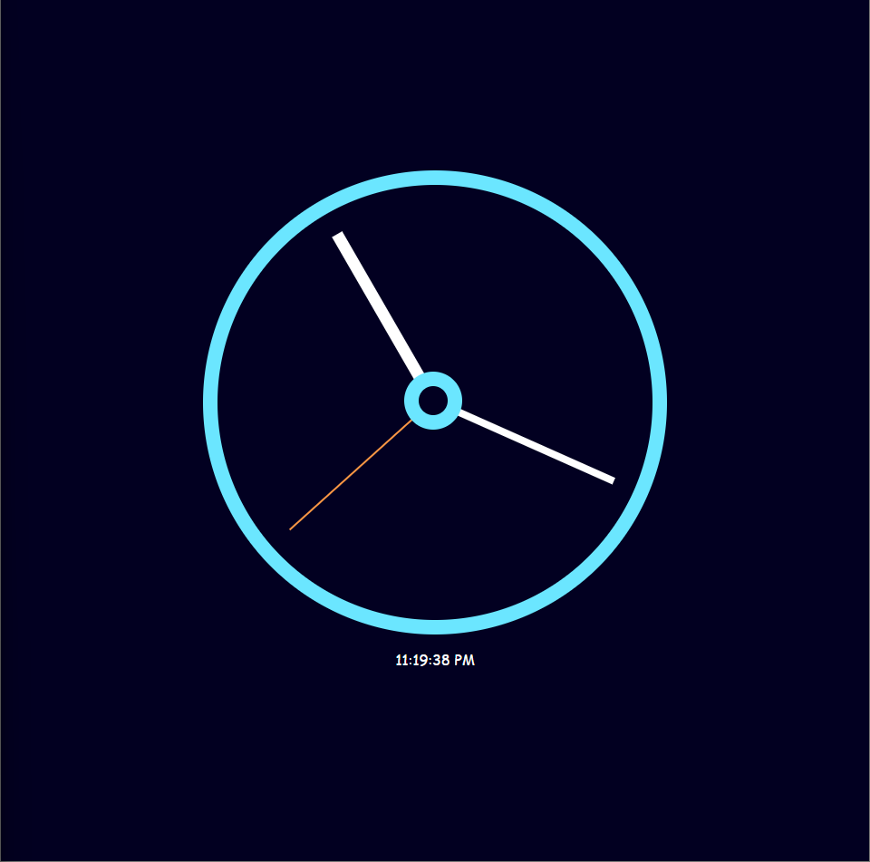

# JavaScript Clock

This is a simple clock built using HTML, CSS, and JavaScript. The clock displays the current time with animated hour, minute, and second hands. It also shows the current time in text format.

## Features

- **Analog Clock:** The clock has animated hour, minute, and second hands.
- **Digital Display:** The current time is displayed in text format.
- **Responsive Design:** The clock is centered on the page and adapts to different screen sizes.

## Preview

## Usage

- Once the project is opened in the browser, the clock will automatically display the current time and update every second.

